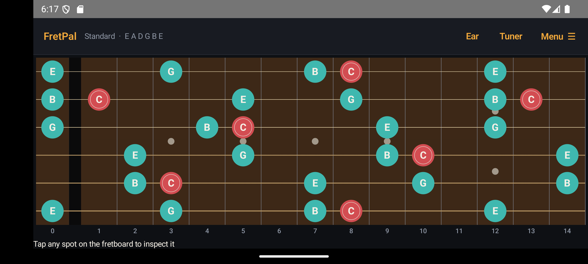
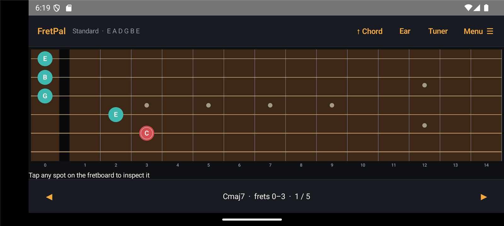
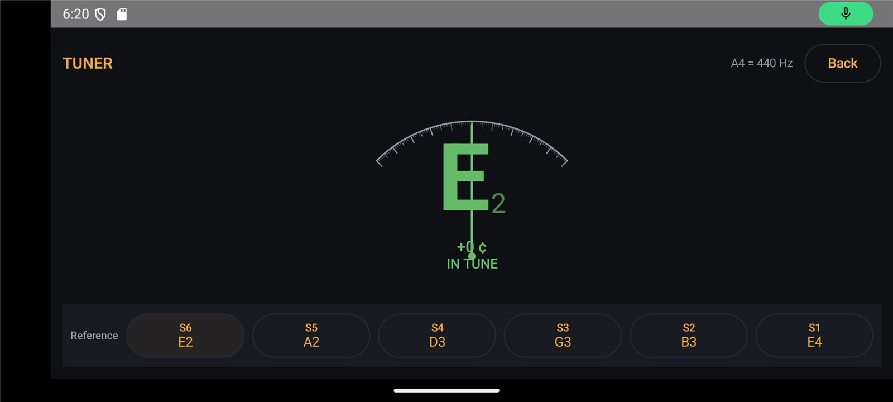
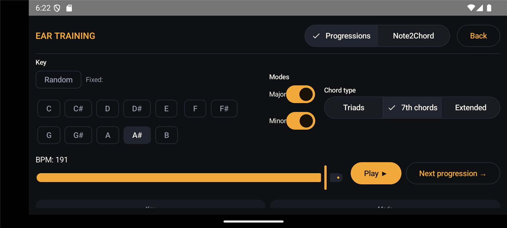

<div align="center">
  <h1>🎸 FretPal</h1>
  <p>
    <strong>The fretboard <em>is</em> the app — an interactive guitar companion for chords, scales, progressions, ear training, and a built-in chromatic tuner.</strong>
  </p>
  <p>
    Tap any spot to hear the note. Pick a chord, see every CAGED voicing across the neck. Pick a scale, see every position. Loop a progression with per-slot voicings. Identify intervals by ear. Tune to within a cent.<br/>
    Offline, no accounts, nothing leaves the device.
  </p>
  <p>
    
    
    
    
    
    
  </p>
</div>

---

## Screenshots

<table>
  <tr>
    <td align="center" width="50%">
      <br/>
      <sub><strong>All-notes view</strong> — every chord tone of <code>Cmaj7</code> lit up across the entire neck.</sub>
    </td>
    <td align="center" width="50%">
      <br/>
      <sub><strong>Positions view</strong> — step through the 5 CAGED shapes for <code>Cmaj7</code>; bottom bar shows the current position.</sub>
    </td>
  </tr>
  <tr>
    <td align="center" width="50%">
      <br/>
      <sub><strong>Tuner</strong> — YIN pitch detection, ±50 ¢ dial with cent ticks, green-tinted "in-tune" band, tappable string references.</sub>
    </td>
    <td align="center" width="50%">
      <br/>
      <sub><strong>Ear training</strong> — random 4-bar progressions in any key/mode with reveal-on-tap chord labels.</sub>
    </td>
  </tr>
</table>

---

## Table of Contents

- [About](#about)
- [Features](#features)
- [Tech stack](#tech-stack)
- [Getting started](#getting-started)
- [Project structure](#project-structure)
- [Running tests](#running-tests)
- [Roadmap](#roadmap)
- [Architecture notes](#architecture-notes)
- [Contributing](#contributing)
- [License](#license)

---

## About

**FretPal** is a music-theory-aware fretboard companion. It treats the neck as the primary interface and layers everything you'd want to study — chord voicings, scale positions, tunings, progressions, ear training, and a chromatic tuner — on top of it.

It's built **Android-first** in native Kotlin so the music-theory engine can stay pure-Kotlin (zero Android dependencies, fast JUnit tests) and the audio path can use the low-latency AAudio route directly. A Kotlin Multiplatform port for iOS is planned — the theory engine ports as-is, only the UI and audio drivers need replacing.

> Three Gradle modules: `theory` (pure JVM), `audio` (Android lib), `app` (Compose UI). The theory engine has 220+ tests that run in milliseconds, with zero emulator dependency.

---

## Features

### 🎸 Fretboard

- **Live, tappable fretboard.** Every position is computed from the current tuning. Tap any fret to hear the note (~20-40 ms tap-to-sound on real hardware) and see its interval relative to the current chord or scale root.
- **Realistic strings.** Wound bass strings get a thicker stroke; plain treble strings render lighter — the visual cue you have on the actual instrument.
- **Landscape-only layout.** The neck dominates the screen. Toggles, settings, and tools live in compact top-bar buttons or bottom-sheet panels.
- **Left-handed mode.** Mirrors the whole fretboard and the tap mapping.
- **Labels.** Switch dots between note names, interval numbers, or empty — persists across launches.

### 🎼 Chords

- **CAGED-canonical voicings.** For each chord, the [`ChordShapeGenerator`](theory/src/main/kotlin/app/guitar/theory/ChordShapeGenerator.kt) returns the 5 CAGED shapes (C / A / G / E / D) spread along the neck rather than crowding the low frets. Step through with the bottom position scroller — each shape labelled with its template and fret span.
- **Jazz / shell-voicings mode.** Toggle in Options. Replaces CAGED with the canonical drop-2 dictionary from jazzguitar.be — 4 inversions per `maj7`, `m7`, `7`, `m7b5`, `dim7`, `6`, `m6`, plus the standard A-rooted `9` shape and middle-4-string voicings.
- **17 chord qualities** × 12 roots = 204 chords. Triads, sevenths, suspended, augmented, diminished, sixths, ninths.
- **Strummed playback** for every shape — Karplus-Strong plucked-string synthesis through the continuous-output mixer.

### 🎵 Scales

- **7 scales** (major, natural / harmonic / melodic minor, major pentatonic, minor pentatonic, blues, dorian, mixolydian, lydian) × 12 roots.
- **Position view** — see scale positions one at a time, scroll along the neck.
- **Formula display** — monospace intervals (e.g. `1 b3 4 5 b7` for A minor pentatonic).

### 🎚️ Tuner

- **YIN pitch detection** (pure Kotlin, unit-tested). Locks within ~2 cents from low E2 (82 Hz) to high E4 (330 Hz).
- **Quarter-ring dial** spanning ±50 cents with 101 ticks (major every 10 ¢, minor every 5 ¢, micro every 1 ¢). Green tint within the ±10 ¢ tuned band.
- **Big tappable note label** — tap to play the equal-tempered reference tone and lock the dial to "spot on" for the sustain duration.
- **Reference row** — one button per open string of the current tuning. Tap to hear the target tone (so you can match by ear before plucking).
- **Configurable A4** — 435 to 445 Hz, persisted.

### 🔁 Progression looper

- **Multi-chord per bar** — 1 slot (whole), 2 (half), or 4 (quarter).
- **Per-slot voicing picker** — chips for every CAGED shape with fret range. Defaults to E-shape (the most common movable barre).
- **Per-slot strum** — `↓` Down, `↑` Up, `≋` Arp, `·` Sustain.
- **Bar count** 1-16, BPM 40-200.
- **Bar / slot highlights** in real time while playing.

### 👂 Ear training

- **Chord progressions.** 9 major + 6 minor common 4-bar progressions (I-V-vi-IV, ii-V-I-I, vi-IV-I-V, I-vi-ii-V, i-VI-III-VII, i-iv-V-i, …). The minor mode uses the harmonic-minor V for the cadence sound. Pick key (Random / Fixed C…B), modes (Major and/or Minor), chord-type level (Triads / 7ths / Extended), BPM. Six grayed-out tap-to-reveal cards: `Key`, `Mode`, plus one per bar showing the Roman label (`Imaj7`, `ii7`, `vii°7`, …).
- **Note2Chord.** A random major or minor triad plays as a block, then a single diatonic non-chord-tone plays on top ~800 ms later. The user identifies the test note's extension label (`9`, `11`, `13`, `maj7` for major; `9`, `11`, `b13`, `b7` for minor). Compact reveal card with the answer + chord + test note name.

### 🎛️ Tuning + audio

- **7 preset tunings:** Standard, Drop D, DADGAD, Open G, Open D, Half-step down, Whole-step down.
- **Custom tunings** — edit each string ±1 semitone or ±1 octave; save by name; persists.
- **Ring sustain** slider in Options — controls how long every note rings, from 300 ms (staccato) to 4 s (drone).
- **Pick mode** — select arbitrary positions across the neck and strum them as a chord or arpeggio.

---

## Tech stack

| Layer | Choice | Why |
|---|---|---|
| Language | **Kotlin 2.1** | JVM-native, modern, no JS toolchain |
| UI | **Jetpack Compose** (Material 3) | Declarative, theme-friendly, smooth animations |
| Audio out | **AudioTrack** (AAudio path) + Karplus-Strong DSP | Sub-50 ms tap-to-sound on hardware |
| Audio in | **AudioRecord** + custom YIN | ~46 ms windows, ±2 ¢ accuracy |
| Persistence | **DataStore Preferences** | Coroutine-friendly modern replacement for SharedPreferences |
| Build | **Gradle 8.11** with the Kotlin DSL + version catalog | Standard for new Android projects |
| Tests | **JUnit 5** + `kotlin.test` | Fast, modern, parameterizable |
| Min Android | **API 26 (Android 8.0)** | Required for low-latency AAudio + adaptive icons |
| Target Android | **API 34 (Android 14)** | Current stable |

The repo is a multi-module Gradle build:

```
FretPal/
├── theory/   ← pure Kotlin, zero Android deps — KMP-ready for iOS later
├── audio/    ← Android library: AudioTrack engine, Karplus-Strong synth, YIN pitch detector, MicInput
└── app/      ← Compose UI: fretboard, sheets, tuner, loop, ear training
```

---

## Getting started

### Prerequisites

- **Windows / macOS / Linux** development host
- **JDK 17 or 21** (Android Studio bundles a compatible JBR)
- **Android SDK** with **API 34** platform installed
- An Android emulator (a Pixel-class AVD with `x86_64` system image) **or** a real device with USB debugging enabled

For Windows setup specifically, see [ANDROID_SETUP.md](ANDROID_SETUP.md) — it walks through hardware virtualization, SDK install, `JAVA_HOME` / `ANDROID_HOME`, and PATH cleanup.

### Build and run

From the project root:

```sh
./gradlew :app:installDebug                                    # build + push to the connected device/emulator
adb shell am start -n app.guitar/app.guitar.app.MainActivity   # launch
```

**On Windows** you can also just double-click `launch-app.bat` — it starts the emulator (with audio) if needed, builds, installs, and launches in one shot.

### A note on emulator audio

The Android Emulator on Windows often defaults to an audio backend that adds 100-300 ms of latency on top of the system's minimum buffer. The `launch-app.bat` script passes `-audio winaudio` to force the lower-latency Windows audio path; if you launch the emulator yourself, do the same:

```sh
emulator -avd Pixel_7 -audio winaudio
```

The Tuner requires the **microphone**. The emulator's mic is silent, so to test the YIN pitch detector live use a real device. (The algorithm itself is verified by 8 unit tests against synthetic sine waves at known frequencies.)

For an accurate feel for the audio latency, test on a real device. On a Pixel-class phone, tap-to-sound is ~20-40 ms.

---

## Project structure

```
FretPal/
├── app/                                       # Android application (Compose UI)
│   └── src/main/kotlin/app/guitar/app/
│       ├── MainActivity.kt                    # entry point, single-Activity layout
│       ├── AppState.kt                        # reactive Compose state holder
│       ├── Theme.kt                           # dark "studio" color scheme + typography
│       ├── FretboardView.kt                   # Canvas-drawn fretboard composable
│       ├── Screens.kt                         # Chord / Scale / Pick / Options bottom sheets
│       ├── TunerScreen.kt + TunerState.kt     # mic-driven quarter-ring tuner
│       ├── LoopScreen.kt + Loop.kt            # progression looper with per-slot voicing/strum
│       ├── EarTrainingScreen.kt + EarTrainingState.kt   # progressions + Note2Chord
│       └── TuningRepository.kt                # DataStore-backed persistence
│
├── audio/                                     # Android library
│   └── src/main/kotlin/app/guitar/audio/
│       ├── AudioEngine.kt                     # interface + no-op
│       ├── AudioTrackEngine.kt                # MODE_STREAM continuous-output mixer
│       ├── PluckedSynth.kt                    # pure-Kotlin Karplus-Strong DSP
│       ├── PitchDetector.kt                   # pure-Kotlin YIN
│       ├── PitchAnalysis.kt                   # Hz ↔ MIDI ↔ cents under configurable A4
│       └── MicInput.kt                        # AudioRecord wrapper
│
├── theory/                                    # Pure-Kotlin music theory (KMP-ready)
│   └── src/main/kotlin/app/guitar/theory/
│       ├── PitchClass.kt Interval.kt Note.kt  # core types
│       ├── Tuning.kt Tunings.kt Fretboard.kt  # instrument model
│       ├── ChordLibrary.kt ChordQuality.kt ChordShape.kt
│       ├── ChordShapeGenerator.kt             # CAGED + brute-force fallback
│       ├── CagedShapes.kt                     # 5 canonical CAGED templates × 12 qualities
│       ├── JazzShellVoicings.kt               # drop-2 dictionary
│       ├── ScaleLibrary.kt Scale.kt ScalePosition.kt FretboardOverlay.kt
│       ├── EarTraining.kt                     # Roman-numeral progressions, resolve()
│       ├── Note2Chord.kt                      # ear-training challenge generator
│       ├── Fingering.kt NoteSpeller.kt        # display helpers
│       └── TuningCodec.kt                     # serialization
│
├── docs/
│   └── screenshots/                           # README screenshots
│
├── ANDROID_SETUP.md                           # Windows setup walkthrough
├── requirements.md                            # original product spec
└── launch-app.bat                             # double-click launcher for Windows
```

---

## Running tests

```sh
./gradlew test                          # all module tests
./gradlew :theory:test                  # theory engine only (pure JVM, fast)
./gradlew :audio:testDebugUnitTest      # audio DSP + YIN + cents
```

**253 tests passing**, zero failures. Highlights:

- **CAGED templates** (62 tests) — every shape verified against its canonical open-position voicing; every chord root produces 5 distinct ascending positions.
- **Jazz drop-2 dictionary** (35 tests) — every inversion of `maj7` / `m7` / `7` / `m7b5` / `dim7` / `6` / `m6` confirmed to contain only the correct chord tones.
- **YIN pitch detector** (8 tests) — locks within ±2 ¢ on A4, low E2, high E4, D3; rejects pure noise and silence; picks the fundamental over a harmonic.
- **Cents math** (9 tests) — A4=440 maps to MIDI 69 with 0 ¢; custom A4 references shift the grid as expected.
- **Ear-training progression resolver** (27 tests) — every Roman degree in major and minor resolves to a parseable chord symbol; "ii"+"m7" displays as `ii7` (not `iim7`); harmonic-minor V is used for the cadence.
- **Note2Chord** (8 tests) — labels for every diatonic non-chord-tone in both major and minor; random sampling covers all 12 roots.
- **Requirements** spec mirror — all 8 tests from `requirements.md` §13 pass.

---

## Roadmap

| Status | Item |
|---|---|
| ✅ | Core theory engine — notes, intervals, tunings, chord/scale libraries |
| ✅ | CAGED chord shape generator with 5 canonical positions per chord |
| ✅ | Jazz drop-2 voicings dictionary |
| ✅ | Compose fretboard with realistic-string rendering |
| ✅ | Tuning persistence + custom tunings |
| ✅ | Karplus-Strong audio engine + continuous-output mixer |
| ✅ | Left-handed mode |
| ✅ | Pick mode + arpeggio |
| ✅ | Loop screen — multi-chord-per-bar, per-slot voicing, per-slot strum |
| ✅ | Chromatic tuner — YIN, ±50 ¢ quarter-ring dial, A4 reference |
| ✅ | Ear training — chord progressions + Note2Chord |
| ✅ | Adaptive launcher icon (rosewood fretboard slice) |
| ✅ | Voice-leading auto-voicing in Loop + Ear training (first chord = E-shape, each next chord = min-movement vs previous) |
| ✅ | Live chord on the fretboard while the loop plays |
| ✅ | Progression playback while displaying chord shapes on the fretboard live |
| ✅ | Open-string letter labels (E A D G B e convention) |
| 🚧 | Cavaquinho mode — Phase 1 shipped (Instrument toggle, DGBe/DGBD tunings, 4-string fretboard, brute-force voicings with 5-fret span). Phase 2 (curated chord library) and Phase 3 (audio timbre) deferred. See [`docs/CAVAQUINHO_PLAN.md`](docs/CAVAQUINHO_PLAN.md). |
| 📅 | **Samba rhythm looper** — a percussion step-sequencer for samba practice. 2 bars of 2/4 (16 sixteenth-note slots), 4 instruments (pandeiro, tamborim, surdo, agogô), tap-to-cycle voices, BPM control. Designed to play alongside the chord-progression looper as a full backing track. See [`docs/SAMBA_LOOPER_PLAN.md`](docs/SAMBA_LOOPER_PLAN.md). |
| 📅 | Custom-chord favorites |
| 📅 | Practice prompts / random challenges |
| 📅 | iOS port via Kotlin Multiplatform |

---

## Architecture notes

### Module boundaries

The three-module split (`theory` / `audio` / `app`) is enforced by Gradle. The `theory` module has **zero Android dependencies** — it compiles to plain JVM bytecode and is fully unit-testable without an emulator. This makes both testing and a future Kotlin Multiplatform port straightforward; only the `app` layer (Compose) and `audio` layer (AudioTrack + AudioRecord) would need iOS-specific replacements.

### Audio out

The output engine went through three iterations before settling on a continuous-output mixer:

1. **Per-tap `AudioTrack` creation** — caused glitches and resource exhaustion under rapid tapping.
2. **Persistent track with pause / flush / play per note** — eliminated the leak but introduced an audible click at every interrupt.
3. **Continuous-output mixer (current)** — one `AudioTrack` in `MODE_STREAM` + `PERFORMANCE_MODE_LOW_LATENCY`, kept in `PLAYING` state for the engine's lifetime, with a dedicated high-priority output thread mixing voices in real time. Synthesis runs on a separate executor so the UI thread never blocks. The output loop intentionally **skips writing when there are no active voices** so the ring buffer stays empty and a fresh tap plays within ~6 ms of buffer latency.

### Audio in (Tuner)

`AudioRecord` at 44.1 kHz mono PCM, 2048-sample windows (~46 ms). Each window is fed to the YIN detector (de Cheveigné & Kawahara, 2002): difference function → cumulative-mean-normalized difference → absolute-threshold local minimum → parabolic interpolation for sub-sample tau refinement. The output frequency is converted to (nearest equal-tempered MIDI note, signed cents) via the configurable-A4 [`PitchAnalysis`](audio/src/main/kotlin/app/guitar/audio/PitchAnalysis.kt). A 4-window per-note smoothing buffer + an RMS energy gate keeps the dial from twitching on silence.

### Theory engine

Built around two value classes (`PitchClass` for the 12-tone scale degree, `Midi` for absolute pitch), plus the data classes `Note`, `Interval`, `Tuning`, `FretPosition`. Every algorithm is a pure function on these types.

For **chord shape generation**, the `ChordShapeGenerator` short-circuits to a canonical voicing dictionary when one exists for the (style, quality, tuning) tuple — `CagedShapes` for Standard mode, `JazzShellVoicings` for Shell mode — and falls back to a brute-force constraint-filtered enumeration otherwise. CAGED templates are encoded as relative fret offsets from the root fret on the shape's primary string, so transposing to any chord root is just a single integer add.

For **ear training**, `EarTraining.resolve()` maps a `(degree, key, mode, chord-type-level)` tuple to a `(chordSymbol, romanLabel)` pair. Diatonic-role tables for major and minor encode the triad / seventh / extended quality at each scale degree; minor mode uses the harmonic-minor V by default so V7→i sounds like the textbook cadence.

---

## Contributing

This is a personal project at the moment. If you're interested in contributing, open an issue first so we can sync on direction.

---

## License

Not yet decided. Treat the code as **all rights reserved** until a `LICENSE` file is added. If you want to use a piece of it, ask.
